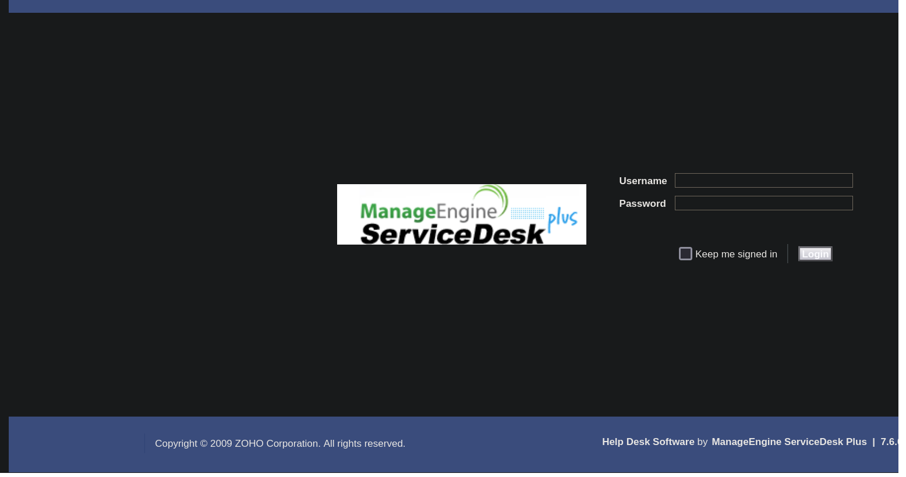
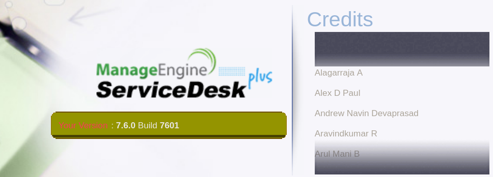
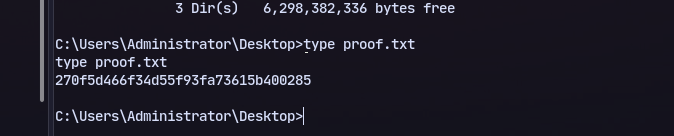

Scanning using nmap:
```
PORT     STATE SERVICE      REASON          VERSION
135/tcp  open  msrpc        syn-ack ttl 125 Microsoft Windows RPC
139/tcp  open  netbios-ssn  syn-ack ttl 125 Microsoft Windows netbios-ssn
445/tcp  open  microsoft-ds syn-ack ttl 125 Windows Server (R) 2008 Standard 6001 Service Pack 1 microsoft-ds (workgroup: WORKGROUP)
8080/tcp open  http         syn-ack ttl 125 Apache Tomcat/Coyote JSP engine 1.1
| http-methods: 
|_  Supported Methods: GET HEAD POST OPTIONS
|_http-title: ManageEngine ServiceDesk Plus
|_http-server-header: Apache-Coyote/1.1
| http-cookie-flags: 
|   /: 
|     JSESSIONID: 
|_      httponly flag not set
Service Info: Host: HELPDESK; OS: Windows; CPE: cpe:/o:microsoft:windows, cpe:/o:microsoft:windows_server_2008:r2

```

We got a website on port 8080:

Using default passwords for this website:
administrator : administrator


